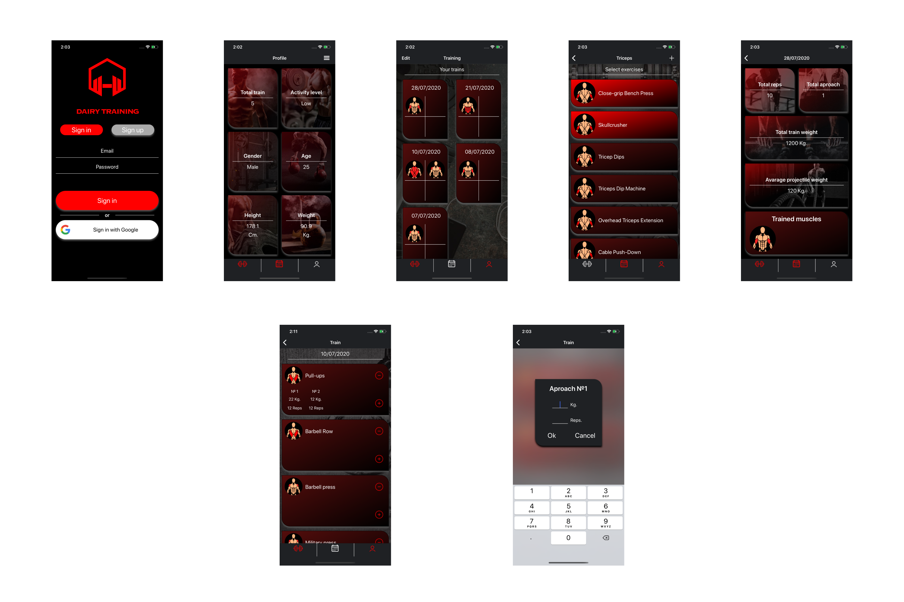

# Dairy-training
> Dairy-train  create training discipline.

[![Swift Version][swift-image]][swift-url]
[![Build Status][travis-image]][travis-url]
[![License][license-image]][license-url]
  

Dairy-train it is an app wich can help to track physical proggress at gym.

## Features

- [x] Log in with Google
- [x] Cloud storage and synhronize your data 
- [x] Tracking training activities 
- [x] Training statistics by each training

## Requirements

- iOS 13.0+
- Xcode 11.5
